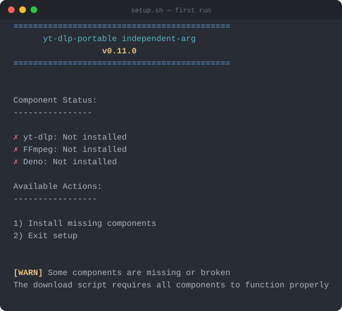
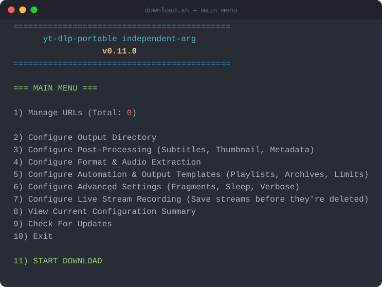
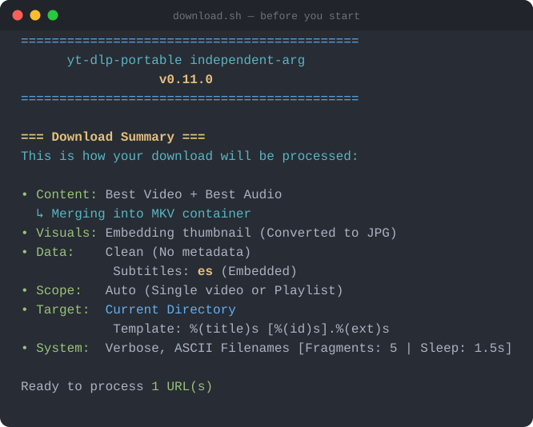

# yt-dlp-portable

A menu-driven wrapper around [yt-dlp](https://github.com/yt-dlp/yt-dlp) that doesn't touch your system. Everything it needs (yt-dlp itself, FFmpeg, and Deno) gets downloaded straight into a `bin/` folder next to the scripts, checksummed, and left alone. No `pip install`, no root, nothing added to your PATH.

Deno is in there because YouTube throws JavaScript challenges at extractors these days, and yt-dlp needs a JS runtime to solve them. That's the only reason it's a dependency at all.

## What you need

Linux, x86_64, and about a gigabyte of free space. `curl`, `tar`, `unzip`, and `sha256sum`, which is to say, whatever's already on your distro.

`setup.sh` takes care of [yt-dlp](https://github.com/yt-dlp/yt-dlp), [FFmpeg](https://github.com/yt-dlp/FFmpeg-Builds), and [Deno](https://github.com/denoland/deno) itself, so you don't need any of those installed beforehand.

## Getting it running

```bash
git clone https://github.com/independent-arg/yt-dlp-portable.git
cd yt-dlp-portable
chmod +x setup.sh download.sh lib.sh
./setup.sh
```

`setup.sh` figures out what's missing and offers to grab it. Every binary gets its SHA256 checked against what the upstream project publishes before it's allowed to run. If a download is corrupted or tampered with, you'll get an error instead of a bad binary sitting in `bin/`.



Run it again whenever you want to check for a newer yt-dlp. It nightly-tracks upstream, since that's the channel yt-dlp itself recommends for getting extractor fixes quickly.

## Downloading things

Works on YouTube, Twitch, and pretty much anywhere else yt-dlp does, which by now is most of the internet.

```bash
./download.sh
```

With no arguments it drops you into a menu. Add a URL, pick a format, decide if you want subtitles or a thumbnail embedded, and go:



Before anything actually downloads, option 8 shows you a plain-language summary of what's about to happen (useful the moment your configuration gets more interesting than "just give me the video"):



If you already know what you want, skip the menu entirely:

```bash
./download.sh --quick "https://youtu.be/whatever"
./download.sh --quick "url1" "url2" "url3"   # batches fine
```

`--quick` uses sane defaults (best video+audio, thumbnail embedded, MKV container) and never stops to ask you anything, which matters if you're calling it from cron. And if what you're grabbing is a live stream that might get taken down, add `--live` to record from the actual start of the broadcast instead of wherever it happens to be when you join:

```bash
./download.sh --quick --live "https://youtube.com/watch?v=some-livestream"
```

## A couple of things worth knowing

- The output directory you pick, and the download-archive file that tracks what you've already grabbed, are remembered **per folder** (wherever you happen to run `download.sh` from). Keep separate download projects in separate folders and they won't step on each other.
- Picking "remux to a container" and "extract audio" are mutually exclusive: turning one on turns the other off, since extracting audio throws away the video stream a remux would apply to.
- Everything yt-dlp itself already defaults to sensibly, this wrapper leaves alone. The options here are the ones that are actually worth having an opinion about.

## When something goes wrong

- `Binary not found` → you haven't run `./setup.sh` yet, or it didn't finish.
- Permission errors → `chmod +x setup.sh download.sh lib.sh`.
- A download just fails → turn on Verbose mode in Advanced Settings and read what yt-dlp actually says. Half the time it's a region lock or a site that wants a login.

## Layout

```
yt-dlp-portable/
├── setup.sh     # grabs and verifies yt-dlp, ffmpeg, deno
├── download.sh  # the actual downloader
├── lib.sh       # shared bits (colors, banner, path handling)
└── bin/         # where setup.sh puts everything
```

## License

The scripts are MIT. yt-dlp, FFmpeg, and Deno bring their own licenses along with them.
